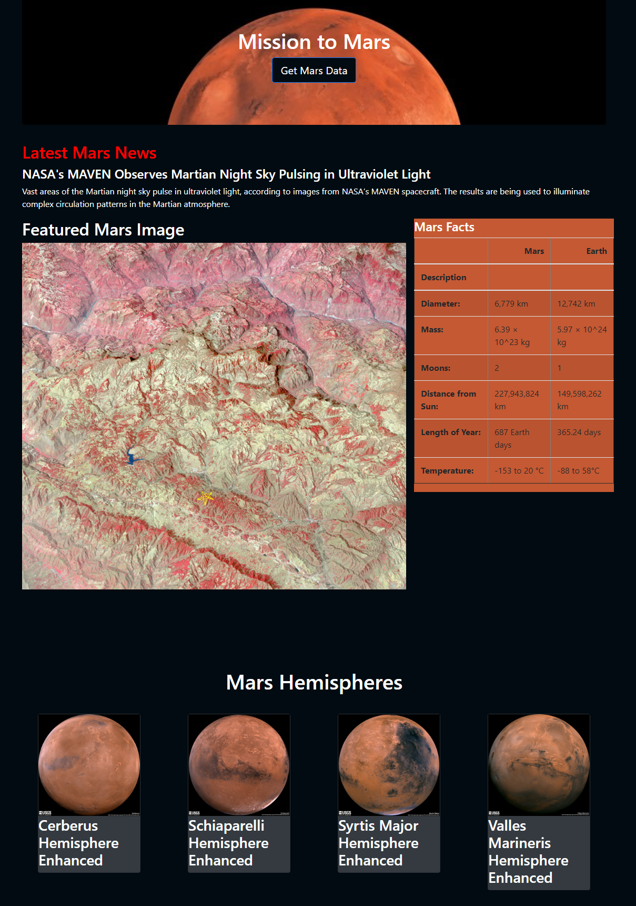

# Mission-to-Mars

## Project Overview
Adjust the current web app to include all four hemispheres images.  

## Resources
- Software: Python Data, Jupyter Notebbok, Visual Studio Code 1.45.1, Pandas, Splinter, MongoDB, beautifulsoup4, Flask

## Challenge Overview

